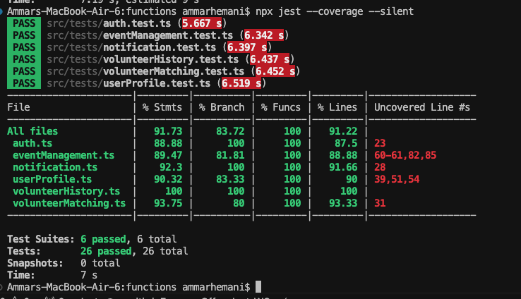
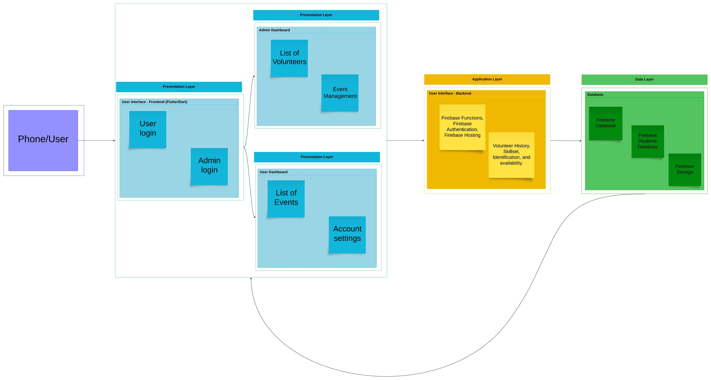

### Frontend Repository
https://github.com/ammarhemani/COSC4353-Group-Project

### Backend stack:
- **Firebase Authentication** - To authenticate users using email and password
- **Firebase Functions** - To deploy backend functions that allow for volunteer matching, event management, pushing notifications, etc.
- **Firebase Firestore** - Collections/Documents database to store all user/events/volunteering data
- **Node.js** - For the code for the backend functions that are being deployed to Firebase Functions
- **Jest** - For unit testing of backend code
- **Eslint** - For linting of backend code

### Frontend stack: Flutter, Dart, Firebase
		
### Development Methodology: Waterfall

| Group Member Name       | What is your contribution?        | Discussion Notes                                                                 |
|-------------------------|-----------------------------------|----------------------------------------------------------------------------------|
| Rasheed Omar            | Authentication module, Database Setup | Assisted in setting up authentication with email and password for the user, as well as setting up the database |
| Muhammad Ammar          | Notifications, User Profile, Frontend connection | Assisted in setting up the notifications module for sending push notifications, as well as connecting everything to the frontend |
| Zainulabdeen Aldawah    | Volunteer History, Volunteer Matching | Assisted in creating the volunteer history module, as well as the volunteer matching |
| Salim Sanogho           | Event Management, Unit tests | Assisted in the events management module, as well as writing the unit tests |

### Code coverage

### High-Level Design / Architecture

